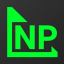

#  NodePlotLib

[](https://github.com/ngfelixl/nodeplotlib/actions?query=workflow%3A%22Node.js+CI%22)
[](https://coveralls.io/github/ngfelixl/nodeplotlib?branch=master)
[](https://npmjs.com/package/nodeplotlib)
[](https://npmjs.com/package/nodeplotlib)
[](https://github.com/prettier/prettier)
[](https://gitter.im/nodeplotlib/)


This readme contains all the necessary information for the development.

## [Go to the user docs](./libs/nodeplotlib/README.md)

## Installation

### Npmjs

```sh
npm install nodeplotlib
# or
yarn add nodeplotlib
```

### Repository

Create a fork of this repository. Then clone it

```
git clone https://github.com/{{USERNAME}}/nodeplotlib
cd nodeplotlib
npm i
```

## Serving the app for development

Serving in development mode prevents the app to open a new browser window on changes.
You can open the app at the specified port, e.g. `http://localhost:4201`.

```
npx nx run web:build -- --watch

NODEPLOTLIB_PORT=4201 npx nx run dev-server:serve
// or on Windows cmd
set "NODEPLOTLIB_PORT=4201" && npx nx run dev-server:serve
// or on Windows Powershell
$env:NODEPLOTLIB_PORT = "4201" ; npx nx run dev-server:serve
```

## Build for production

To build for production three steps are necessary. Build the web app, build
the library, and finally copy the web app files to the libraries dist folder.
All steps are bundled in the following script:

```
npm run build:prod
```

All dist files are located in **/dist/libs/nodeplotlib**

## Release Guide

This is a note for maintainers only. There are several steps to follow before you
can publish the new version to npm.

1. Bump the version number using semver. Use "rc" for release candidates as the _preid_, e.g.
   `1.0.0-rc1`. Updat the version number in the root [package.json](./package.json)
   and in the libs [package.json](./libs/nodeplotlib/package.json).
2. If everything is committed and in place on "master" for non-release candidates,
   or on "release/..." for release candidates. Create a tag with that version number,
   e.g. `v1.0.0-rc1` or `v1.0.1`, and push it to the repository.
3. Run `npm run build:prod`
4. Navigate to **/dist/libs/nodeplotlib**
5. Run `npm pack`
6. Make sure to be logged in to npmjs. Then run
   - `npm publish {{filename}}.tgz` or
   - `npm publish {{filename}}.tgz --tag test` for release candidates.
7. Create a release on Github for non-release cadidate versions.

## Behind the scenes

The lib launches a webserver and opens new tabs for every plot located at
`http://localhost:{{PORT}}`, where `PORT` is a free port determined by the express
server itself. At this address the Angular application will be served temporarily.
The server and the app set up a connection via socket.io. This way a realtime
transmission is possible.

## Contributing

Contributions in all forms are welcome.

## Contributors

<a href="https://github.com/ngfelixl"></a>
<a href="https://github.com/mitsos1os"></a>
<a href="https://github.com/medved-nsk"></a>
<a href="https://github.com/Moumouls"></a>
<a href="https://github.com/grgr-dkrk"></a>
